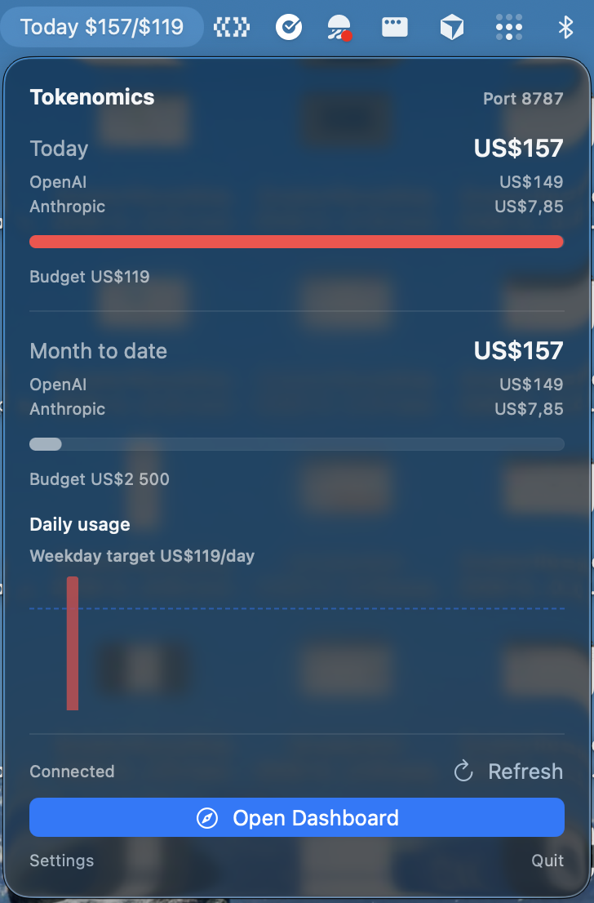

# Native macOS menu bar client

This is a small macOS 14+ companion for the local Tokenomics service. It shows
today's and month-to-date usage in the menu bar, with a compact provider
breakdown and daily chart.

The client reads the existing local HTTP API. It does not read provider logs,
query the database, or store usage data.

## Screenshot



## Run from source

Start Tokenomics from the repository root:

```sh
node launcher.js --sqlite --no-open
```

Then run the native client in a second terminal:

```sh
cd mac
swift run TokenomicsMenubar
```

The first Tokenomics sync may take longer than later refreshes. The client does
not start Tokenomics automatically on first launch, so source testing should
start the service first.

Run the Swift checks from `mac/`:

```sh
swift test
swift build -c release
```

This PR does not create or distribute an app bundle. Packaging, signing,
notarization, and installation are separate rollout steps.

## Connection and lifecycle

The default port is `8787`. The client connects only to the configured local
port and confirms that `GET /api/sync` returns a known Tokenomics state before
using it.

| Scenario | Behavior |
| --- | --- |
| First launch | The client checks the configured port. If Tokenomics is not running, it shows an offline state and does not start anything automatically. |
| Tokenomics is already running | The client reuses it. It does not take ownership of that process and will not stop it. |
| Tokenomics is started from the client | Start is always an explicit action and requires a valid launch command. The client owns that process and its children. |
| The client quits or changes port | It stops only the Tokenomics process tree that it started. It does not stop ClickHouse or a Tokenomics instance it found already running. |
| A sync fails but the service still responds | The last good totals stay visible and are marked as stale. |
| The connection is lost | Cached totals are cleared, the client shows offline, and the user can retry. Automatic refresh also retries when enabled. |
| Another service uses the port | The client does not treat it as Tokenomics or try to replace it. The user must choose another port or stop the other service. |
| The Mac wakes from sleep | The client checks the service again and syncs if automatic sync is enabled. |

Starting Tokenomics can include its initial local sync. The client shows bounded
launcher output while it waits and gives up after 30 minutes. Canceling or
failing startup stops the process tree it created.

## API and presentation

The client uses the existing endpoints:

- `GET /api/sync` to identify the service and read sync state.
- `POST /api/sync` to request a refresh.
- `GET /api/summary` to render usage and cost data.

This package does not change the existing Tokenomics server, `launcher.js`,
stored configuration, or database. Extra response fields are ignored so the
client can keep working as the API grows.

For API profiles, the menu client calculates a weekday allowance from the
monthly limit, spend through yesterday, and remaining Monday-Friday days in
UTC. This is display logic only. It does not change the budget or write anything
back to Tokenomics. Subscription profiles show API-equivalent cost without a
monetary allowance.
